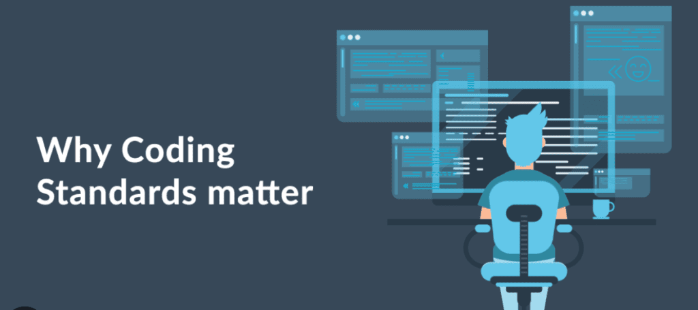

 

## Introduction

Artificial Intelligence (AI) has rapidly become a transformative force in education, offering students and instructors alike new ways to teach, learn, and collaborate. In the realm of Software Engineering—where problem solving, code quality, and effective documentation are paramount—AI tools have proven particularly relevant. Over the past semester in ICS 314, I’ve incorporated a variety of AI-driven assistants into my workflow, including ChatGPT for conversational guidance, GitHub Copilot for code completion, and diagram‑generation features in Bard and Co‑Pilot. In this essay, I’ll reflect on how these tools shaped my experience in ICS 314, from tackling “WOD” practice problems to composing essays and architecting my final project.

## Personal Experience with AI

Throughout ICS 314, I found myself turning to AI tools for nearly every aspect of coursework, from practice problems to project documentation. Early on, when I encountered the Experience WOD E18—where the provided tutorial was woefully outdated—I asked ChatGPT, “I’m working on WOD E18: implement an underscore‑style map and filter. The course tutorial is from an older version—can you provide updated step‑by‑step instructions?” Within seconds, I received a runnable example that jump‑started my implementation. Although the initial output needed tweaks to align with our project’s scaffolding, the AI saved me hours of guesswork.

Similarly, during in‑class practice WOD sessions—particularly those on recursion—I used ChatGPT as a real‑time tutor. Prompting it to “Explain in simple terms how a recursive tree traversal works and provide pseudocode” helped me verify my understanding before writing any code. In contrast, I resisted using AI during timed, in‑class WODs under pressure; the latency of suggestions disrupted my flow, so I found it more effective to collaborate directly with peers in real time.

When it came to writing assignments, AI became an indispensable ally. After drafting my essay on software testing, I asked ChatGPT to proofread my paragraphs, “correct my grammar, and add a light humorous tone while keeping my voice.” The result was a more polished, engaging essay that highlighted mistakes I would have otherwise missed. Likewise, for the final project—where I built a Next.js/Prisma application—I used Bard to generate an initial Entity‑Relationship Diagram. A prompt like “Generate an ERD showing User, Post, and Comment tables with their relationships” produced a clear diagram, though I later refined cardinalities manually.

Beyond projects and essays, AI guided my conceptual learning and classroom participation. To master async/await in TypeScript, I asked GitHub Copilot for “an example of using async/await to fetch data from an API and handle errors,” which provided concise code I could dissect. Before posting questions in Discord—say, about a Prisma environment‑variable error—I consulted ChatGPT: “Why am I getting ‘Environment variable not found: POSTGRES_PRISMA_URL’ in Prisma?” Its explanation led me to correct my .env setup even before my peers responded. Similarly, when formulating smarter, more focused questions—such as comparing dependency injection and aspect‑oriented programming—I drafted my query with AI assistance to ensure clarity and precision.

AI also streamlined many everyday coding tasks. For simple examples—like using _.pluck to extract a property array—I asked ChatGPT directly and received exactly the snippet I needed, then followed up with “Explain how .pluck works under the hood” to solidify my knowledge. Whenever I wrote new code—such as scaffolding an Express.js route handler—I prompted Copilot to generate boilerplate, which freed me to focus on business logic. To document that code, ChatGPT produced consistent JSDoc comments when I supplied the function signature and asked for parameter and return descriptions.

Finally, AI played a pivotal role in quality assurance and ancillary tasks. When ESLint errors flooded my console, I pasted both the error messages and my code into ChatGPT with “Fix the ESLint errors in this snippet,” and it corrected formatting issues immediately—though I learned to specify “don’t disable any rules” to avoid unwanted changes. Beyond ICS 314’s core elements, I even used GitHub Copilot to draft CI/CD workflows in GitHub Actions and create a .gitignore file, shaving hours off setup tasks. In each case, the instant feedback and scaffolding provided by AI dramatically accelerated my progress, even as I remained mindful to validate and understand every suggestion.

## Impact on Learning and Understanding

Incorporating AI into ICS 314 has been a double‑edged sword. On one hand, on‑demand explanations and code scaffolding greatly accelerated my comprehension and productivity. I could prototype ideas faster, catch syntax errors immediately, and focus on higher‑level design. On the other hand, I sometimes caught myself relying on AI without deeply understanding the underlying concepts. To counteract that, I adopted a “show me the why” approach—always asking follow‑up questions about how and why a solution works, rather than just what the solution is.

## Practical Applications

Beyond ICS 314, I’ve leveraged AI in real‑world projects. In my Smart Campus Energy Lab, I asked ChatGPT to help write Python scripts that parse and visualize sensor data, accelerating my data‑analysis workflow. During a hackathon (the HACC), Copilot scaffolded my React components, and ChatGPT aided in brainstorming feature roadmaps. In each case, AI proved effective at jump‑starting development and clarifying complex tasks.

## Challenges and Opportunities

Challenges included occasional inaccurate or incomplete AI responses, which could derail my workflow if taken at face value, and a risk of superficial understanding if I blindly accepted AI‑generated code. Opportunities lie in integrating AI more deeply into curriculum—perhaps via automated code review bots that give instant feedback on assignments, or AI‑driven tutoring sessions tailored to each student’s knowledge gaps.

## Comparative Analysis

| Aspect                          | Traditional Methods                                   | AI‑Enhanced Approaches                     |
| -------------------             | -----------------------------------------             | ------------------------------------------ |
| Engagement                      | In‑person lectures, peer discussion                   | Interactive prompts, 24/7 accessibility    |
| Knowledge retention             | Struggle‑then‑learn model (deep but slow)             | Quick wins but risk of surface learning    |
| Skill development               | Manual coding and debugging                           | Rapid prototyping, less low‑level practice |
|                                 |                                                       |                                            |

Traditional teaching fosters deep problem‑solving skills through manual struggle, while AI enables rapid iteration and reduces tedium—but must be balanced with intentional practice to ensure lasting understanding.

## Future Considerations

Looking ahead, AI could power personalized learning paths—automatically diagnosing a student’s weak areas and adapting tutorials in real time. Improvements in model accuracy and domain‑specific fine‑tuning will reduce “hallucinations” and make AI a more reliable partner. However, educators must continue emphasizing critical thinking: students should learn to question and validate AI output, not accept it blindly.

## Conclusion

My journey in ICS 314 has shown that AI tools can dramatically speed up development, enhance writing quality, and provide on‑demand tutoring—but they also bring the risk of superficial learning and occasional errors. Going forward, I recommend that instructors integrate AI thoughtfully: require students to submit both AI‑assisted and self‑written explanations, encourage follow‑up “why” questions, and use AI feedback as a supplement rather than a replacement for human guidance. With these guardrails in place, AI can be an invaluable asset in software engineering education.

  

The essay above used ChatGPT for spelling and grammar correction/suggestions.
