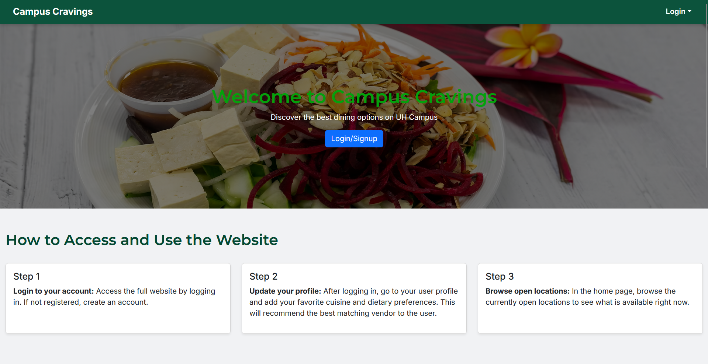
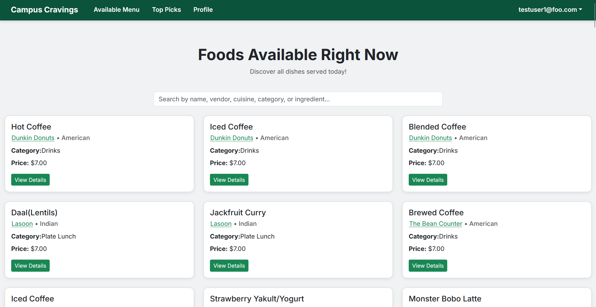
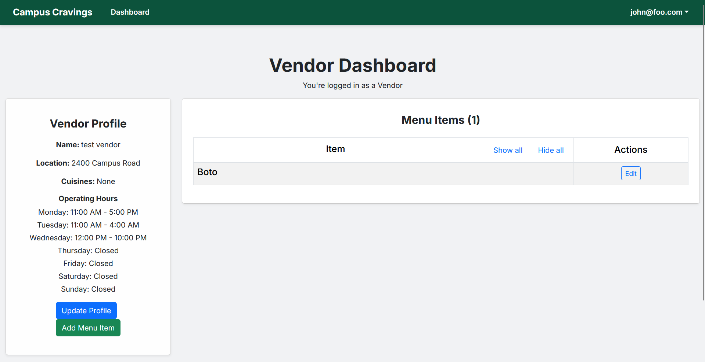

Worked on a web application that provides information on vendors around UH Manoa's campus for my ICS314 final project.

The website allows users to create an account and view the locations of vendors around UH Manoa's campus. They are able to input their favorite cuisines and allergies in the user's settings to get better recommendations of vendors suited for their preferences. They can also view the vendor location in Google Maps by clicking on it.

The vendors are able to create an account and upload their vendor on the page, providing its name, cuisine type, location, and hours of operation. The admin is able to edit anything on the website, having ultimate access.

In this project I gained experience with software engineering, web application development, and user interface customization/editing with a group of students.

Here are images of the website:

  
User Page:

  
Vendor Page:

