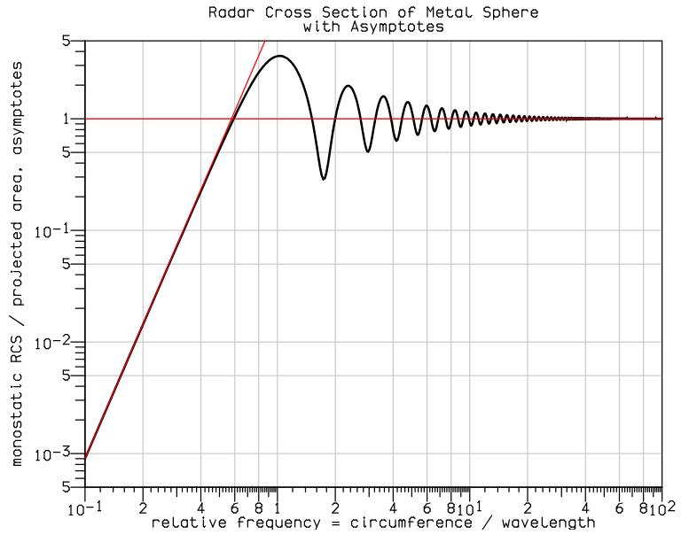

Researching and working together with a PhD student on constructing a viable testing setup to monitor human vitals using a 2.4GHz radar instead of electrode patches.

Currently trying to verify the accuracy of our current testing environment by comparing the reflected signal from an aluminum sphere with the theoretical Radar Cross Section (RCS) graph shown below, which show the signal behaviour in the near field, resonance region, and far field. After verifying the accuracy of our setup, we will begin testing using real humans.

Doing this research, I am gaining knowledge on radar testing and application.

Here is the RCS plot we are trying to get/verify:

