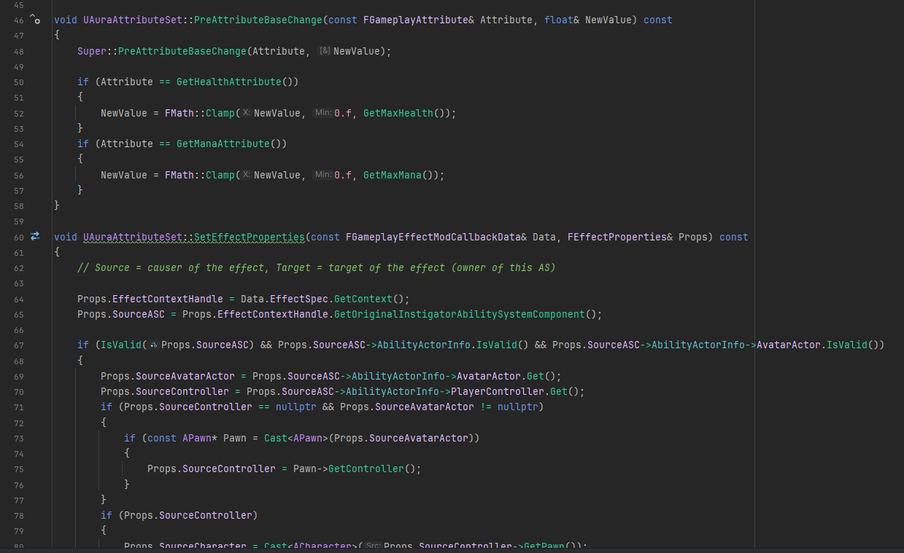

Working on a top down action RPG game in my free time since Summer 2024. The project helps me learn the essence of game development and the use of Unreal Engine's Gameplay Ability System framework.

The game is implemented using Unreal Engine, a 3D computer graphics game engine, and JetBrains Rider, an IDE used to program gameplay features in C++.

In this project I gained experience with Unreal Engine's GAS framework, character animations, weapon and item visual effects, and basic enemy AI.

Here is an image of a small portion of my code for the Attribute Sets:

